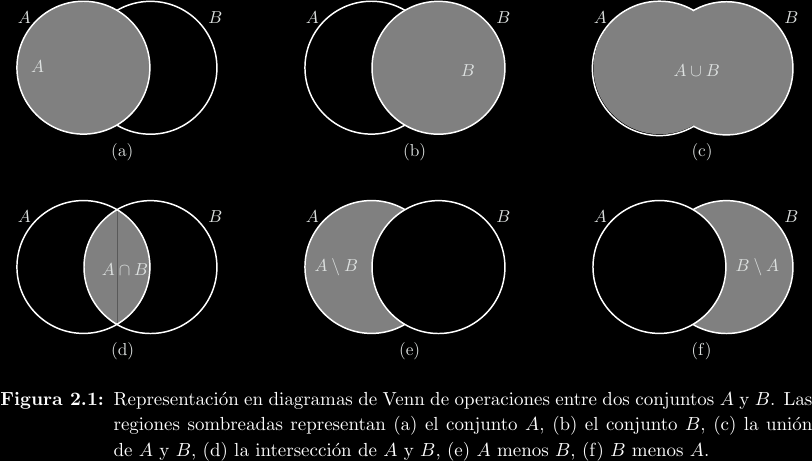
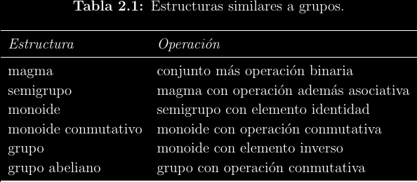
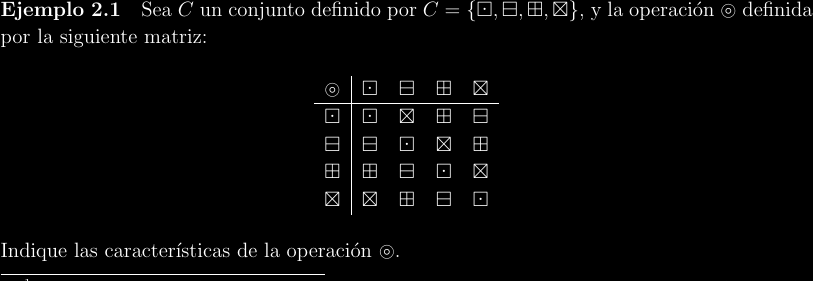
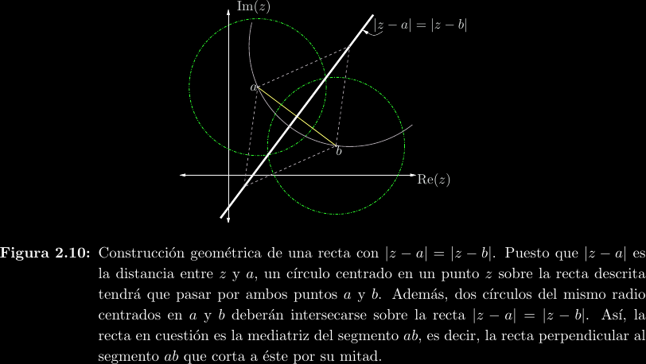
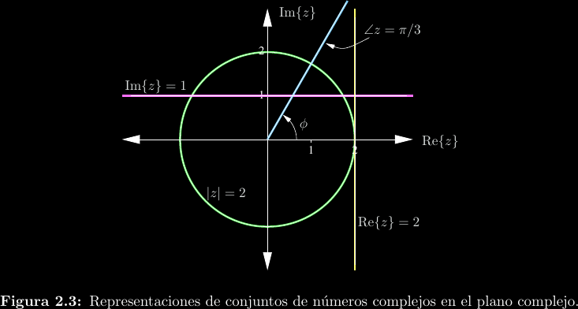
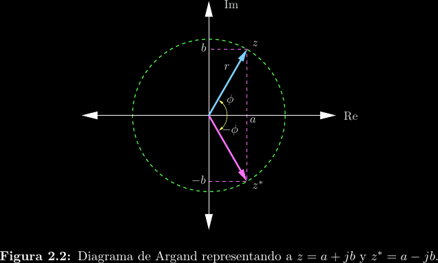
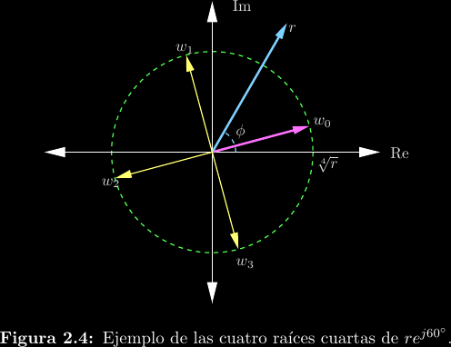

# Conjuntos, estructuras y el plano complejo

Se necesitan algunos conceptos previos:

- Conjunto: Difícil de definir formalmente sin crear paradojas, vamos a usar la
  noción intuitiva.

- Estructura algebraica: Un conjunto asociado a una operación sobre elementos
  de ese conjunto. Por ejemplo, los reales \\(\mathbb{R}\\) junto a la
  operación de negación \\(-x\\) conforman una estructura de operación unaria.

- Nos interesan las estructuras algebraicas con operaciones binarias.

## El conjunto \\(\mathbb{C}\\)

Se define a través la unidad imaginaria \\(j\\) que cumple \\(j^2 = -1\\).
\\[z = a + jb = re^{j(\theta + 2k\pi)} = r\cos(\theta) + jr\sin(\theta); k \in \mathbb{Z}\\]

Podemos definir muchos constructos en el plano utilizando ecuaciones
e inecuaciones en términos de la variable \\(z = x + jy\\).

- Puntos: Decimos \\(z_0 = 1 - j2\\) para referirnos al punto cartesiano
  \\((1, -2)\\). A los ejes les llamamos eje real y eje imaginario.

- Distancias y corrimientos: La distancia entre dos puntos \\(a\\) y \\(b\\) es
  \\(|a - b|\\).

- Rectas paralelas a los ejes: En los reales esto corresponde a las
  ecuaciones \\(x = c\\) y \\(y = c\\), por lo que en los complejos
  decimos \\(\mathrm{Re}\\{z\\} = c\\) e \\(\mathrm{Im}\\{z\\} = c\\).

- Semirrectas: Como los números complejos pueden expresarse en
  forma de magnitud y ángulo, podemos construir "rayos" que provienen
  del origen con ecuaciones como \\(\angle z = \theta\\).

- Rectas: Todos los puntos de una recta cumplen estar a la misma distancia
  de tanto un punto \\(a\\) como un punto \\(b\\), por lo que es posible
  escribir una recta como \\(|z - a| = |z - b|\\).

- Círculos: Sabemos que \\(|z|^2 = x^2 + y^2 = r^2\\), por lo que una
  circunferencia centrada en el origen está expresada por \\(|z| = r\\). Si
  "desfasamos" \\(z\\) es posible mover el origen. Por ejemplo, \\(|z - (3 +
  j5)| \lt 2\\) es el interior de un círculo centrado en \\(z_0 = 3 + j5\\) y
  con un radio de \\(2\\).

### Conjugación

Si \\(z = a + jb = re^{j\theta}\\), su conjugado es \\(z^\* = a - jb =
re^{-j\theta}\\).  En otras palabras, invierte el signo del ángulo, lo cual
crea un "espejo" alrededor del eje real.

La conjugación tiene dos propiedades de cancelación:
\\[z + z^\* = 2\mathrm{Re}\\{z\\}\\]
\\[z - z^\* = j2\mathrm{Im}\\{z\\}\\]

### Multiplicación y división

Para multiplicar en forma rectangular, tenemos que:
\\[(a + jb)(c + jd) = (ac - bd) + j(ad + jbc)\\]
Pero es más fácil si lo hacemos en forma polar, ya que:
\\[r_1e^{j\theta_1}\cdot r_2e^{j\theta_2} = r_1r_2e^{j(\theta_1 + \theta_2)}\\]
Para dividir en forma rectangular es necesario utilizar el conjugado:
\\[\frac{a + jb}{c + jd} = \frac{a + jb}{c + jd}\cdot\frac{c - jd}{c - jd} = \frac{(a + jb)(c - jd)}{c^2 + d^2} = \frac{z_1z_2^\*}{|z_2|^2}\\]
Esto nos muestra da una importante propiedad del conjugado:
\\[zz^\* = |z|^2\\]
Dividir también es más fácil en forma polar:
\\[\frac{r_1e^{j\theta_1}}{r_2e^{j\theta_2}} = \frac{r_1}{r_2}e^{j(\theta_1 - \theta_2)}\\]

### Raíces complejas

Sea \\(z = re^{j(\theta + 2k\pi)}\\), entonces \\(w =
\sqrt[n]{r}e^{\frac{j}{n}(\theta + 2k\pi)}\\) es una raíz enésima de \\(z\\).
La redundancia polar se vuelve importante aquí, ya que \\(k\\) evaluado desde
\\(0\\) hasta \\(n - 1\\) produce \\(n\\) distintas raíces, acomodadas
geométricamente por un cambio constante de rotación. Todos los complejos
distintos de cero (incluyendo a los reales, que también son complejos) tienen
exactamente \\(n\\) raíces enésimas distintas.

### Potencias y logaritmos

El logaritmo complejo se puede deducir fácilmente a partir de la forma polar:
\\[\ln\left(re^{j(\theta + 2k\pi)}\right) = \ln(r) + \ln\left(e^{j(\theta + 2k\pi)}\right) = \ln(r) + j(\theta + 2k\pi)\\]
Así que en los complejos existen muchos logaritmos para un mismo número, no solo uno. Típicamente se habla del logaritmo principal (se identifica por la mayúscula),
\\[\mathrm{Ln}(z) = \ln_{k = 0}(z)\\]
Debido a argumentos parecidos tenemos que
\\[z^w = e^{\ln{z^w}} = e^{w\ln{z}}\\]
Por lo que la exponenciación también tiene una rama principal e infinitas adicionales por redundancia polar.

### Funciones circulares

Recordando la fórmula de Euler, \\(e^{j\theta} = \cos(\theta) + j\sin(\theta)\\),
podemos extender las funciones seno y coseno a argumentos complejos:
\\[\cos(z) = \frac{e^{jz} + e^{-jz}}{2}\\]
\\[\sin(z) = \frac{e^{jz} - e^{-jz}}{j2}\\]
En este mismo estilo, podemos definir nuevas funciones análogas, llamadas
funciones hiperbólicas, como las partes par e impar de la función exponencial:
\\[\cosh(z) = \frac{e^{z} + e^{-z}}{2} = \cos(jz)\\]
\\[\sinh(z) = \frac{e^{z} - e^{-z}}{2} = -j\sin(jz)\\]
