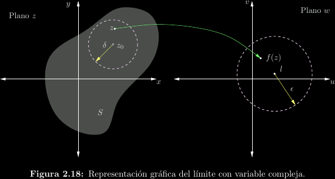

# Derivación compleja

En las funciones de variable real se habla de límites laterales por la
izquierda y por la derecha. Se dice que un límite está definido solo si estos
dos límites laterales existen y además concuerdan. Como las derivadas no son
más que límites con una forma particular, una derivada existe solo si existen
las derivadas por la izquierda y por la derecha y ambas concuerdan.

El concepto de límite se puede extender a los complejos, pero con una
complicación adicional: existen infinitas direcciones por las cuales tomar el
límite, en vez de solo dos, y todas ellas deben existir y concordar para que la
derivada compleja exista. Esta misma situación ocurre para continuidad en una
función de variable compleja, ya que una función \\(f(z)\\) es continua en 
\\(z = z_0\\) si y solo si:
\\[f(z_0) = \lim_{z\to z_0}{f(z)}\\]

Intuitivamente, podemos entonces decir que continuidad y derivabilidad son
propiedades mucho más fuertes en los complejos que en los reales, en el sentido
de que son más difíciles de alcanzar. El poder decir que una función de
variable compleja es derivable abre la puerta a muchas simplicacioones y
garantías acerca de la función.

Estas implicaciones son tan amplias que existen varios términos para llamar a
una función derivable en una región. Aunque no exactamente idénticos, de
momento los trataremos como si lo fueran.

- **Diferenciable**: La función es continua y su derivada existe congruentemente desde infinitas direcciones.
- **Holomorfa**: La función es infinitamente diferenciable. Nótese que esto implica que si una función puede derivarse una vez, necesariamente puede seguirse derivando cuantas veces se quiera.
- **Analítica**: La función puede expandirse en una serie de potencias convergente (por ejemplo, de Taylor).

Esa tripleta de propiedades prácticamente equivalentes es uno de los resultados
más centrales e importantes del análisis complejo. Es el fundamento de todo lo
que sigue en esta unidad.

## ¿Y cómo se deriva una función de variable compleja?

Para nuestros intereses, se deriva exactamente igual que si la función fuese de
variable real. Aplican las mismas reglas y teoremas. Por ejemplo,
\\(\left(\mathrm{Ln}(z)\right)' = \frac{1}{z}\\). Equivalentemente, se puede
obtener una derivada compleja por definición a través de las ecuaciones de
Cauchy-Riemann.

## Ecuaciones de Cauchy-Riemann

Determinar la equivalencia de infinitas derivadas direccionales no es sencillo.
Por suerte, Cauchy y Riemann demostraron que es suficiente con encontrar que la
función es derivable desde dos direcciones ortogonales, como son los ejes real e
imaginario. Sea \\(f(z) = f(x + jy) = u(x, y) + jv(x, y)\\). \\(f(z)\\) es
diferenciable/holomorfa/analítica en aquellos puntos donde se cumple que:
\\[\exists f'(z) \iff \frac{\partial u}{\partial x} = \frac{\partial v}{\partial y} \land \frac{\partial u}{\partial y} = -\frac{\partial v}{\partial x}\\]
O, equivalentemente,
\\[f'(z) = \frac{\partial u}{\partial x} + j\frac{\partial v}{\partial x} = \frac{\partial v}{\partial y} - j\frac{\partial u}{\partial y}\\]

Si las ecuaciones de Cauchy-Riemann se cumplen, se dice que \\(u(x, y)\\) y
\\(v(x, y)\\) son funciones **conjugadas**. Puede demostrarse que dos funciones
conjugadas deben ser también funciones **armónicas**, es decir, que satisfacen
la ecuación de Laplace \\(\nabla^2 f = 0\\):
\\[\frac{\partial^2 u}{\partial x^2} + \frac{\partial^2 u}{\partial y^2} = \frac{\partial^2 v}{\partial x^2} + \frac{\partial^2 v}{\partial y^2} = 0\\]
Esta relación permite encontrar una de las funciones conjugadas dada la otra, con
lo cual es posible construir una función analítica completa.

## Conformidad

Se dice que un mapeo \\(w = f(z)\\) es **conforme** si los ángulos entre curvas
arbitrarias se preservan al aplicar el mapeo. Esto ocurre en aquellos puntos
donde \\(f(z)\\) es analítica y además \\(f'(z) \ne 0\\)

