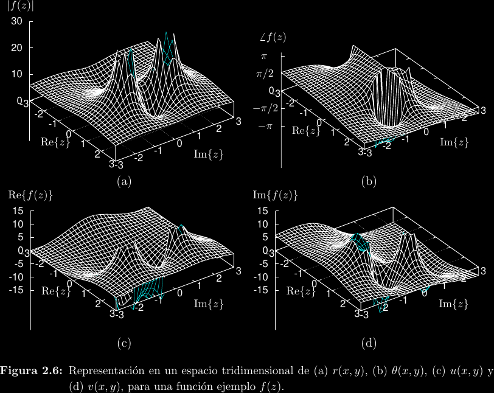
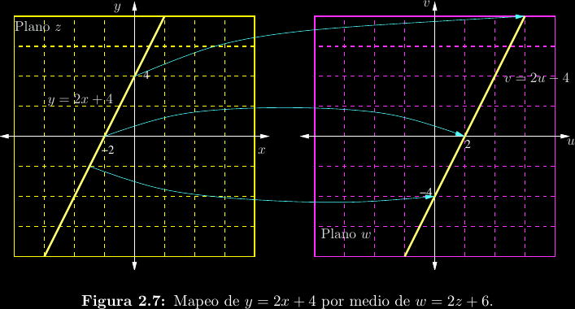
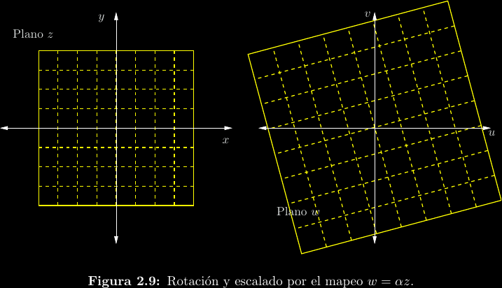
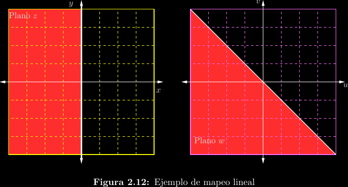
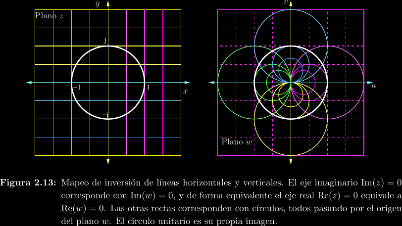
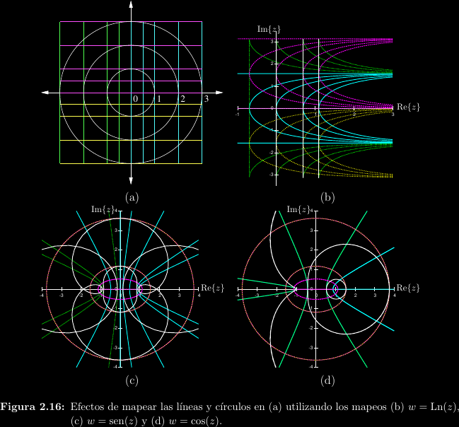

# Funciones de variable compleja

A diferencia de las funciones de variable real, las funciones \\(f : \mathbb{C}
\to \mathbb{C}\\) de variable compleja pueden siempre descomponerse tanto en
sus argumentos como en sus imágenes:
\\[w = f(z) = f(x + jy) = u(x + jy) + jv(x + jy) = r(x + jy)e^{j\theta(x + jy)}\\]
Donde \\(u, v, r, \theta : \mathbb{C} \to \mathbb{R}\\). 

Esta idea nos permite transformar o **mapear** figuras en el plano \\(z = x +
jy\\) de Argand al plano \\(w = u + jv\\) de Argand utilizando la función de
mapeo \\(w = f(z)\\). Por ejemplo, consideremos el mapeo \\(w = 2z + 6\\)
aplicado a la recta \\(y = 2x + 4\\).

Es posible que un punto no cambie al aplicarse un mapeo, tal que \\(z = f(z)\\),
caso bajo el cual se llama **punto fijo**.

## Mapeos lineales

Se les llama lineales a los mapeos de la forma
\\[w = \alpha z + \beta = |\alpha||z|e^{j(\angle\alpha + \angle z)} + \beta\\]
Ddonde \\(\alpha\\) y \\(\beta\\) son constantes complejasarbitrarios. Nótese que
la segunda forma en la que se ha escrito esto describe las tres operaciones que un
mapeo lineal es capaz de realizar:

- Escalamiento: La magnitud de \\(z\\) se multiplica con la magnitud de
  \\(\alpha\\).  Esto es equivalente a "subir la escala"; es decir, agrandar o
  reducir las formas geométricas.

- Rotación: Al ángulo de todo punto \\(z\\) se le agrega \\(\angle \alpha\\).
  Es decir, se rota el plano entero. Recordar que las rotaciones antihorarias
  son positivas y las horarias son negativas.

- Traslación: Luego de las dos operaciones anteriores (el orden de operaciones
  es importante) se agrega un offset \\(\beta\\) a todos los puntos.

Puede entenderse a un mapeo lineal como un mapeo de escalamiento y rotación
seguido de un mapeo de traslación. El mapeo que vimos anteriormente es
un mapeo lineal. Otro ejemplo es el siguiente:

## Mapeos de inversión

Otro tipo común de mapeo es el mapeo de inversión, dado por
\\[w = \frac{1}{z} = \frac{1}{r}e^{-j\theta}\\]
La interpretación geométrica de este mapeo es un poco menos
evidente. Nótense primeramente los casos extremos de magnitud
para \\(z\\):

- Si \\(|z| \to 0\\), entonces \\(|w| \to \infty\\).
- Si \\(|z| \to \infty\\), entonces \\(|w| \to 0\\).

Esto tiene varias consecuencias en las figuras que se mapean,
ya que algunas de ellas contendrán a estos casos particulares
y otras no:

- Una circunferencia que no incluye al origen se mantiene siendo
  una circunferencia bajo un mapeo de inversión. Su radio se invierte
  y la circunferencia se refleja con respecto al eje real.

- Una circunferencia que incluye al origen se vuelve una recta. Entonces,
  se puede entender a una recta como una circunferencia de radio infinito.

- Toda recta "incluye" al infinito, por lo que cualquier recta mapeada
  producirá un punto en el origen. La figura será una recta si la recta
  original pasa por el origen, o una circunferencia con vértice en el origen en
  caso contrario.

- Las rectas paralelas a los ejes mantienen el comportamiento intuitivo.

## Otros mapeos

Los mapeos bilineales son el cociente de dos mapeos lineales,
\\[w = \frac{az + b}{cz + d} = \lambda + \frac{\mu}{\alpha z + \beta}\\]
Donde \\(\lambda = \frac{a}{c}\\), \\(\mu = bc - ad\\), \\(\alpha = c^2\\)
y \\(\beta = cd\\). Nótese que en esta segunda forma se observa más claramente
qeu un mapeo bilineal no es más que un mapeo lineal seguido de un mapeo de
inversión y finalmente otro mapeo lineal.

Hay muchos otros tipos de mapeos, pero ya se han cubierto los más relevantes.

