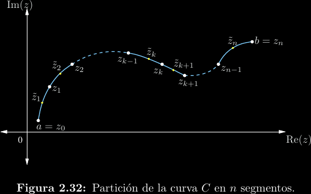
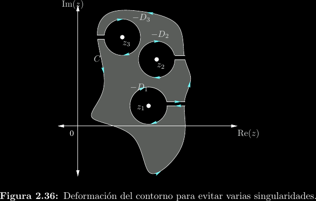
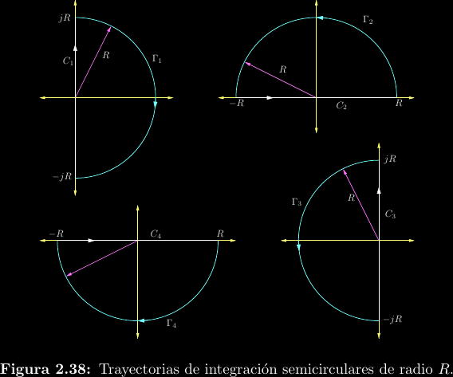
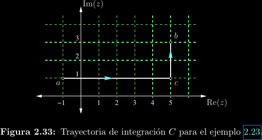
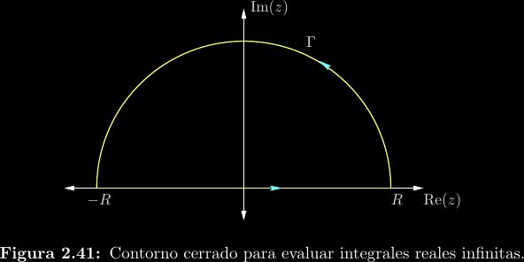
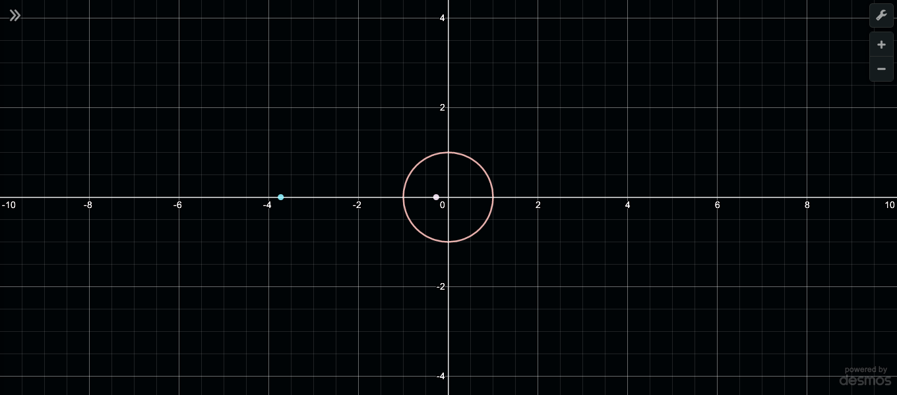

# Integración compleja

> Residues arise […] naturally in several branches of analysis […]. Their
> consideration provides simple and easy-to-use methods, which are applicable
> to a large number of diverse questions, and some new results […].
>
> &mdash; Augustin-Louis Cauchy, Sur un nouveau genre de calcul, 1826.

Como no existe un ordenamiento de los complejos (no puede responderse si \\(z_1
\> z_2\\) en el caso general), no podemos hablar de integrales definidas a como
se tratan en análisis real:
\\[\int_a^b{f(x)\mathrm{d}x} = F(b) - F(a); \frac{\mathrm{d}}{\mathrm{d}x}F(x) = f(x)\\]

En su lugar, para integrar desde un complejo \\(a\\) a un complejo \\(b\\),
debemos además definir una **trayectoria de integración** \\(C\\) de entre
muchas posibles. A las integrales resultantes les denominamos **de contorno** o
**de línea**:
\\[\begin{align*}\int_C{f(z)\mathrm{d}z} &= \int_C{(u(x, y) + jv(x, y))(\mathrm{d}x + \mathrm{d}y)} \\\\ &= \int_C{(u(x, y)\mathrm{d}x - v(x, y)\mathrm{d}y)} + j\int_C{(v(x, y)\mathrm{d}x + u(x, y)\mathrm{d}y)} \\\\ &= F(b) - F(a)\end{align*}\\]

Esta última equivalencia en términos de antiderivadas es el **teorema
fundamental para integrales de línea** y solo sirve si \\(f(z)\\) es analítica
en todo el plano. Si \\(C\\) es una curva cerrada que no se interseca a sí
misma&mdash;como por ejemplo una circunferencia&mdash;utilizamos una notación
especial para la integral de contorno:
\\[\oint_C{f(z)\mathrm{d}z}\\]

## Teorema de la integral de Cauchy

Este es un caso particular del teorema fundamental para integrales de línea en
el caso de contornos cerrados. Si \\(a\\) es un punto en la curva cerrada y
simple \\(C\\) y además \\(f(z)\\) es analítica en tanto \\(C\\) como su
interior, puede decirse que la curva inicia y termina en el mismo punto
\\(a\\), por lo cual:
\\[\oint_C{f(z)\mathrm{d}z} = F(a) - F(a) = 0\\]

Las implicaciones de este teorema son profundas, al punto de que también se le
conoce como **teorema fundamental de la integración compleja**. Algunas de ellas
son:

- Si una función compleja es diferenciable, necesariamente también es
  integrable. Esto puede entenderse como una consecuencia indirecta de que las
  funciones diferenciables sean holomorfas, pues cada una de las infinitas
  derivadas debe poseer su integral en la dirección contraria.

- Las restricciones de la condición de holomorfismo son tan fuertes que, sin
  importar la escogencia de la función \\(f(z)\\) y la curva \\(C\\), la
  integral de contorno será cero siempre que la función no tenga singularidades
  sobre o dentro de \\(C\\).

- El valor de una integral compleja de contorno cerrado depende solamente de
  los polos encerrados por el contorno. Esto quiere decir que:
  \\[\oint_{C}{f(z)\mathrm{d}z} = \sum_{n}{\oint_{C_{pn}}{f(z)\mathrm{d}z}}\\]

  Donde \\(C_{pn}\\) es algún contorno cerrado&mdash;posiblemente un
  subcontorno de \\(C\\)&mdash;que solo contiene al polo \\(n\\) de \\(f(z)\\).
  La suma de integrales cubre solo los polos encerrados por \\(C\\).

  

## Fórmula de la integral de Cauchy

Esta relación permite encontrar \\(f(z_0)\\) o cualquiera de sus derivadas,
asumiendo que la imagen está definida y que \\(z_0\\) es parte del interior de \\(C\\).
\\[f^{(n)}(z_0) = \frac{n!}{2\pi j}\oint_{C}{\frac{f(z)}{(z - z_0)^{n + 1}}\mathrm{d}z}\\]

En particular, cuando \\(n = 0\\),
\\[f(z_0) = \frac{1}{2\pi j}\oint_{C}{\frac{f(z)}{z - z_0}\mathrm{d}z}\\]

Lo cual lleva a un método para el cálculo de integrales de contorno alrededor
de un polo \\(z_0\\):
\\[\oint_{C}{\frac{f(z)}{z - z_0}\mathrm{d}z} = 2\pi j\cdot f(z_0)\\]

## Teorema del residuo

El **teorema del residuo** es, de los tres, el resultado más general para
la evaluación de integrales de contorno. Lee:
\\[\oint{f(z)\mathrm{d}z} = 2\pi j\sum_{i = 1}^{n}{c_{-1}^{(i)}}\\]

Es decir, la suma de los residuos asociados a todos los polos dentro de la
región de integración.

- Esto quiere decir que si una expansión en serie de Laurent tiene un residuo
  distinto de cero, entonces el centro de la serie es un polo.  Esto coincide
  con lo que ya conocemos, puesto que si \\(c_{-1}\\) es distinto de cero
  entonces el centro \\(z_0\\) es un polo de al menos primer orden.

- Junto a la fórmula de la integral de Cauchy, permite relacionar el valor de
  \\(f(z_0)\\) con el residuo de \\(\frac{f(z)}{z - z_0}\\) para una expansión
  centrada en \\(z_0\\). Es decir, este teorema ayuda a "agregar polos"..

## Parametrizaciones

Frecuentemente encontraremos patrones regulares que permiten simplificar nuestras
integrales. Algunos de ellos son:

- Arcos con centro en el origen: En estos casos podemos realizar la sustitución
  \\(z = e^{j\theta} = \cos(\theta) + j\sin(\theta)\\), lo cual nos permite
  reducir la variable de integración a una variable real angular.

  

- Líneas horizontales o verticales: En estos casos encontraremos que alguno de
  \\(\mathrm{d}x\\) o \\(\mathrm{d}y\\) es cero. Nuevamente se reduce el
  problema a integrandos complejos con variables de integración reales.

  

## Evaluación de integrales reales

Las integrales complejas de contorno simplifican el cálculo de algunos tipos de
integrales reales a través del uso de estos poderosos teoremas.

### Integrales impropias sobre todos los reales

Dada alguna función real \\(f(x)\\) se tiene por continuación analítica que
\\[\int_{-\infty}^{\infty}{f(x)\mathrm{d}x} = \oint_D{f(z)\mathrm{d}z}\\]

Bajo la condición de que \\(\lim{z \to \infty}{z f(z)} = 0\\). \\(D\\) es el
contorno que se muestra a continuación, donde el radio \\(R\\) tiende a
infinito:

### Integrales de funciones trigonométricas

Si \\(G(\sin(\theta), \cos(\theta))\\) es racional y real, entonces
\\[\int_0^{2\pi}{G(\sin(\theta), \cos(\theta))\mathrm{d}\theta} = \oint_D{f(z)\mathrm{d}z}\\]

Donde \\(D\\) es la circunferencia unitaria \\(|z| = 1\\) en dirección
positiva. Puede demostrarse que las sustituciones respectivas son:
\\[\begin{align*}z &= e^{j\theta} \\\\ \mathrm{d}\theta &= \frac{\mathrm{d}z}{jz} \\\\ \sin(\theta) &= \frac{1}{2j}\left(z - \frac{1}{z}\right) \\\\ \cos(\theta) &= \frac{1}{2}\left(z + \frac{1}{z}\right) \end{align*}\\]

# Ejemplo

\\[\begin{align*}
  &\int_0^{2\pi}{\frac{1}{2 + \cos(\theta)}\mathrm{d}\theta} \\\\
  =& \oint_C{\frac{1}{jz\left(2 + \frac{1}{2}\left(z + \frac{1}{z}\right)\right)}\mathrm{d}z}; C: |z| = 1 \\\\
  =& \frac{2}{j}\oint_C{\frac{1}{4z + z^2 + 1}\mathrm{d}z} \\\\
  =& \frac{2}{j}\oint_C{\frac{1}{(z - (-2 - \sqrt{3}))(z - (-2 + \sqrt{3}))}\mathrm{d}z} \\\\
  =& \frac{2}{j}\oint_C{\frac{1 / (z - (-2 - \sqrt{3}))}{z - (-2 + \sqrt{3})}\mathrm{d}z} \\\\
  =& \frac{2}{j}\left(2\pi j\cdot\frac{1}{(-2 + \sqrt{3}) - (-2 - \sqrt{3})}\right) \\\\
  =& \frac{2\pi\sqrt{3}}{3}
\end{align*}\\]

