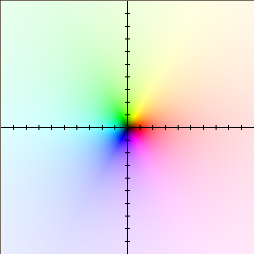
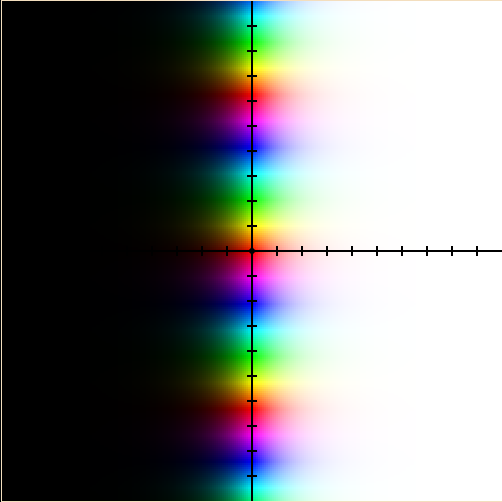
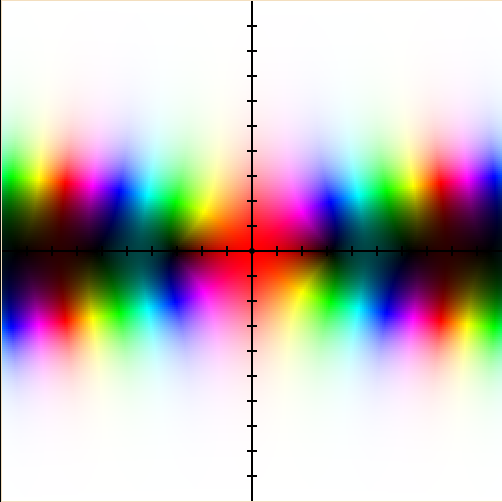
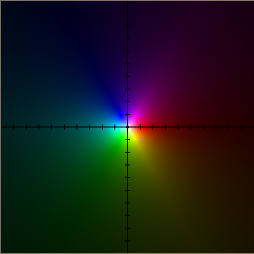
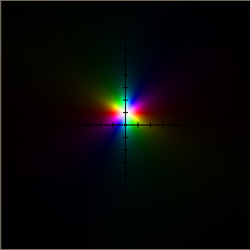
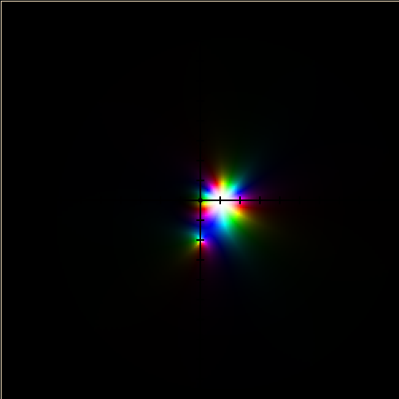
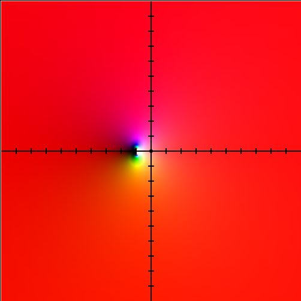

# Singularidades, polos y ceros

## Coloreado de dominio

Esto no es parte de la materia, pero lo utilizaremos para aclarar la teoría de
puntos. Un [diagrama de coloreado de
dominio](https://jutanium.github.io/ComplexNumberGrapher/) (utilicé ese para
generar todas las imágenes) es un tipo de gráfica en dos dimensiones de una
función en variable compleja.  El tono representa la fase y la claridad la
magnitud de los valores de la función.  Se incluyen algunas gráficas para
acostumbrar a la idea:

- \\(f(z) = z\\)

  

- \\(f(z) = e^z\\)

  

## Puntos del dominio

Cada uno de los puntos del dominio de una función \\(f(z)\\) se pueden
clasificar según si la función es analítica o no en ese punto. Sabemos que
las series de Laurent se ven fuertemente afectadas por esta propiedad. Sea \\(z_0\\) un
punto del dominio de \\(f(z)\\). Si desarrollamos una serie de Laurent para \\(f(z)\\)
centrada en \\(f(z_0)\\), tenemos que:

- Si \\(f(z)\\) es analítica en \\(z = z_0\\), \\(z_0\\) es un **punto regular**.

  - Equivalentemente, la parte principal de la serie será cero (\\(c_n = 0\\)
	para \\(n < 0\\)), lo cual quiere decir que será equivalente a una serie de
	Taylor iniciada en \\(n = 0\\).

    \\[\sum_{n = -\infty}^{\infty}{c_n(z - z_0)^n} = \sum_{n = -\infty}^{-1}{c_n(z - z_0)^n} + \sum_{n = 0}^{\infty}{c_n(z - z_0)^n} = \sum_{n = m}^{\infty}{c_n(z - z_0)^n}\\]

  - Si \\(f(z_0) = 0\\), el punto regular es además un **cero**.

	- El **orden** \\(m\\) del cero es la cantidad de coeficientes consecutivos
	  al inicio de la serie de Taylor que se anulan.

  - Un punto regular que no es un cero se puede interpretar como un "**cero de
	orden cero**". Generalmente, el término "punto regular" se utiliza para
	ceros de orden cero y no para otros tipos de ceros, con tal de evitar
	confusiones.

  - Como la función es analítica en el punto regular, es infinitamente diferenciable
    en este punto. Un cero de orden \\(m\\) cumple que,
	\\[f(z_0) = 0, f'(z_0) = 0, f''(z_0) = 0, ..., f^{(m - 1)}(z_0) = 0, f^{(m)}(z_0) \ne 0\\]

- Si \\(f(z)\\) no es analítica en \\(z = z_0\\), \\(z_0\\) es una **singularidad**.

  - Si los coeficientes de la parte principal se anulan consecutivamente hasta
	los últimos \\(m\\) términos, la singularidad es un **polo** de orden
	\\(m\\). 

    \\[\sum_{n = -\infty}^{\infty}{c_n(z - z_0)^n} = \sum_{n = -\infty}^{-1}{c_n(z - z_0)^n} + \sum_{n = 0}^{\infty}{c_n(z - z_0)^n} = \sum_{n = -m}^{\infty}{c_n(z - z_0)^n}\\]

  - Los polos aislados (es decir, no inmediatamente rodeados de otros polos) de
	orden finito son singularidades **removibles**. Esto quiere decir que podemos
	definir por partes a una variante de la función en donde se le asigna un valor
	a este punto particular que coincida con el límite de la función original.

	\\[\mathrm{Sa}(z) = \begin{cases}\frac{\sin(z)}{z}, &z \ne 0 \\\\1, & z = 0\end{cases}\\]

    

  - Si el orden es infinito (los coeficientes de la parte principal tienen
	infinitos términos que no se anulan), el resultante "polo de infinito
	orden" se conoce como **singularidad esencial**. Las singularidades
	esenciales son "críticas" y **no removibles**, ya que el comportamiento
	alrededor de la singularidad cambia según la dirección.

  - Los puntos regulares también son "**polos de orden cero**", además de ser
	ceros de orden cero.

  - Un polo de orden \\(m\\) es también un cero de orden \\(-m\\) y viceversa.

  - \\(f(z)\\) es **meromorfa** si todas sus singularidades son removibles. En
	otras palabras, una función meromorfa se puede "arreglar" fácilmente para
	volverla holomorfa en todo \\(\mathbb{C}\\).

- En el caso de funciones racionales, los órdenes de ceros y polos son sus
  multiplicidades. En la formulación siguiente, los ceros de \\(N(z)\\) son
  también los ceros de \\(f(z)\\), y los ceros de \\(D(z)\\) son los polos de
  \\(f(z)\\).

  \\[f(z) = \frac{N(z)}{D(z)} = A_0\frac{(z - z_{c1})^{m_{c1}}(z - z_{c2})^{m_{c2}}\cdots}{(z - z_{p1})^{m_{p1}}(z - z_{p2})^{m_{p2}}\cdots}\\]

- Pueden haber polos y ceros en \\(z = \infty\\), por lo que siempre hay que
  estudiar estos dos casos. Recordar la esfera de Riemann y su asociación con
  series de Taylor "invertidas" (exteriores de círculos).

- A los polos y ceros de orden \\(1\\) o primer orden se les suele denominar
  **simples**.

## Ejemplos

- \\(f(z) = 1 + 2z - 3z^2 = -3(z + \frac{1}{3})(z - 1)\\) tiene ceros de orden
  \\(1\\) en \\(z = -\frac{1}{3}\\) y \\(z = 1\\). El resto de puntos del
  dominio son puntos regulares.

- \\(f(z) = z^{-1} = \frac{1}{z}\\) tiene un polo de orden \\(1\\) en \\(z = 0\\).
  El resto de puntos son regulares.

  

- \\(f(z) = (z - j)^{-2}\\) tiene un cero de orden \\(-2\\) en \\(z = j\\) y una
  singularidad esencial en \\(z = \infty\\).

  

- \\(f(z) = \frac{z + 1}{(z + j2)(z - 1)^3}\\) tiene un cero de primer orden en
  \\(z = -1\\), una singularidad esencial en \\(z = \infty\\), un polo de primer orden
  en \\(z = -j2\\) y un polo de tercer orden en \\(z = 1\\).

  

- \\(f(z) = e^{1 / (z + 1)}\\) tiene una singularidad esencial en \\(z = -1\\).

  \\[e^z = 1 + \frac{z^1}{1!} + \frac{z^2}{2!} + \cdots + \frac{z^n}{n!} + \cdots\\]
  \\[\implies e^{1 / (z + 1)} = 1 + \frac{(z + 1)^{-1}}{1!} + \frac{(z + 1)^{-2}}{2!} + \cdots + \frac{(z + 1)^{-n}}{n!} + \cdots\\]

  

## Residuos

Podemos expresar la sucesión de coeficientes de Laurent como
\\[\ldots, c_{-n}, \ldots, c_{-2}, c_{-1}, c_0, c_1, c_2, \ldots, c_n, \ldots\\]

El coeficiente \\(c_{-1}\\)&mdash;el último de la parte principal&mdash;es especial y se
conoce como el **residuo** de la serie asociada. Puede determinarse
directamente a través del método del límite para separación en fracciones
parciales:
\\[c_{-1} = \frac{1}{(m - 1)!}\lim_{z\to z_0}{\frac{\mathrm{d}^{m - 1}}{\mathrm{d}z^{m - 1}}(z - z_0)^m f(z)}\\]

Donde \\(m\\) es el orden de polo del centro \\(z_0\\). Esta fórmula solo sirve
para series centradas en polos y no singularidades esenciales. Nótese que el
residuo es una propiedad de una serie y no de la función que sintetiza, por lo
que cada posible expansión de una función tendrá su propio residuo.

En la siguiente sección estudiaremos algunas de las utilidades de los residuos.
