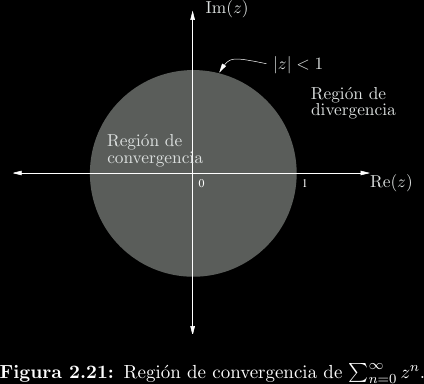
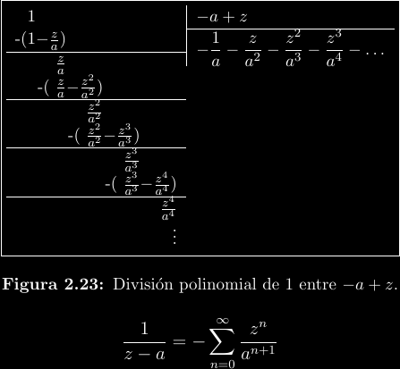
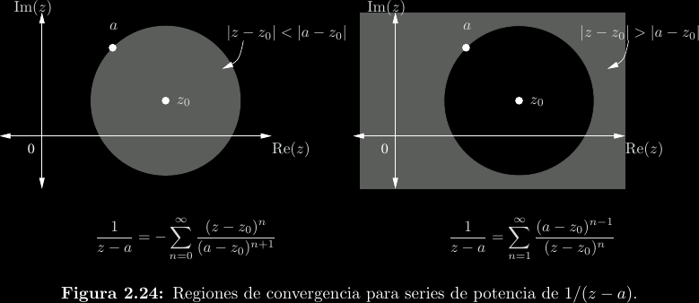
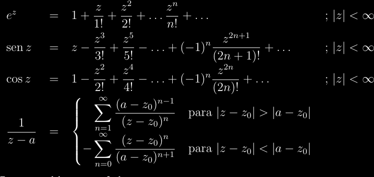
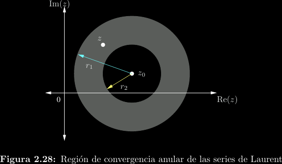
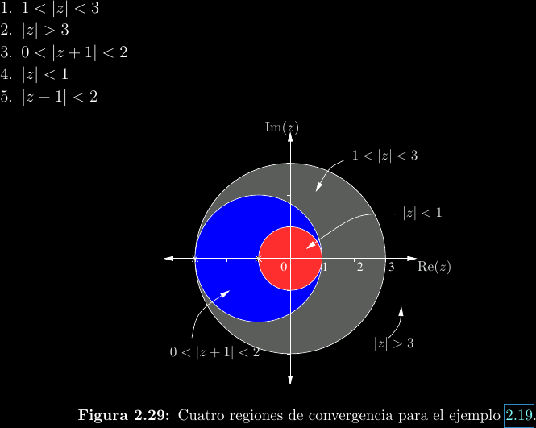

# Series complejas

Anteriormente mencionamos que las funciones diferenciables son también
analíticas, lo cual significa poder de expresar la función en términos de una
serie de potencias convergente (**síntesis**). En variable real, escribiríamos
algo como
\\[f(x) = \sum_{n = 0}^{\infty}{c_n (x - x_0)^n}\\]
Donde \\(x_0\\) es el centro de la serie en la línea real y \\(c_n\\) son los
coeficientes de la serie, los cuales podrían determinarse con el teorema de
Taylor o herramientas semejantes.

Por el principio de **continuación analítica**, el cual
ya hemos mencionado antes, puede "extenderse" la serie de potencias
real al caso complejo siempre que la función real correspondiente sea analítica:
\\[f(z) = \sum_{n = 0}^{\infty}{c_n (z - z_0)^n}\\]
Esto quiere decir que tales funciones como \\(e^z\\), \\(\sin(z)\\), \\(\cos(z)\\)
tienen el mismo comportamiento y reglas en variable compleja que lo que se conoce
para variable real. Por ejemplo, tales propiedades como \\(e^{a + b} = e^a e^b\\)
y \\(\sin^2(z) + \cos^2(z) = 1\\) se siguen manteniendo.

Uno de los principales cambios en series complejas es que la idea de un radio
de convergencia se generaliza a regiones de convergencia (**ROC**), aunque
estas típicamente siguen siendo asociadas a un radio.  Para series de esta
forma (iniciando en \\(n = 0\\)), se puede encontrar el radio de convergencia
utilizando el criterio de d'Alembert:

\\[f(z) = \sum_{n=0}^{\infty}{c_n(z - z_0)^n} \implies R = \lim_{n\to\infty}{\left\vert\frac{c_n}{c_{n + 1}}\right\vert}\\]

Posteriormente se mostrará que la serie converge en la ROC \\(|z - z_0| < R\\).
Como ejemplo se muestra una serie y su ROC:

\\[\frac{1}{1 - z} = \sum_{n=0}^{\infty}{z^n}; |z| < 1\\]

## Múltiples expansiones

La forma más primitiva de encontrar series para una función es la división de
polinomios. Por ejemplo, para \\(\frac{1}{z - a}\\) donde \\(a\\) es alguna
constante, se puede realizar esta división de dos maneras. La primera es:

Esta primera serie converge si \\(|z| > |a|\\). Podemos decir que la serie está
"centrada en infinito", lo cual se visualiza fácilmente utilizando la **esfera
de Riemann**, una extensión de los complejos que trata a \\(\infty\\) como un
elemento más del conjunto.

La segunda serie, que ocurre si cambiamos el orden del denominador, es:

Esta otra serie converge si \\(|z| < |a|\\), con centro en el origen. A continuación
se muestran las dos regiones de convergencia:

Esta "ruptura" en dos síntesis distintas para la misma función se debe a que en
\\(z = a\\) encontramos un **polo**, un tipo de discontinuidad (queda una
división entre cero) que estudiaremos más adelante. Nótese que, debido a la
virtual equivalencia entre una función analítica y una función diferenciable,
la razón de delimitar la serie en un polo es que la función deja de ser
analítica en el mismo.

## Series de Taylor

Es posible realizar un desarrollo de potencias general para funciones diferenciables.
A esto le denominamos **series de Taylor**. El teorema de Taylor nos otorga directamente
la sucesión de coeficientes. Para un desarrollo de \\(f(z)\\) alrededor de \\(z_0\\) se
cumple que:
\\[c_n = \frac{f^{(n)}(z_0)}{n!}\\]
La región de convergencia será \\(|z - z_0| < R\\), donde el radio de convergencia
\\(R\\) es el máximo permisible antes de llegar a un polo de la función.

Se muestran a continuación algunas series de Taylor comunes:

## Series de Laurent

Son extensiones de las series de Taylor que pueden converger en **anillos**, no
solo en interiores y exteriores de círculos, como se observa. Esto significa que
pueden cubrir áreas delimitadas por polos, algo que las series de Taylor no pueden
lograr.

Las series de Laurent toman una forma más general que cubre todos los enteros, en
vez de iniciar en \\(n = 0\\):
\\[f(z) = \sum_{n = -\infty}^{\infty}{c_n (z - z_0)^n}\\]

Esta suma puede separarse en una parte de términos de potencias negativas
denominada **parte principal** y una parte de términos positivos (\\(n = 0\\)
cuenta como "positivo") que se denomina **parte de Taylor**. Es la parte
principal la que le confiere a la serie de Laurent su capacidad para "borrar"
parte de la región de convergencia que es mandatoria para una serie de Taylor.
Estudiemos el caso de expandir la siguiente función en distintas
ROCs: \\[f(z) = \frac{1}{(z + 1)(z + 3)}\\]

