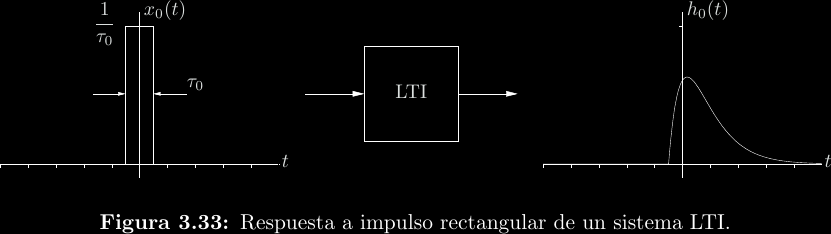
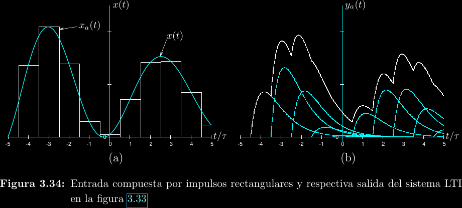
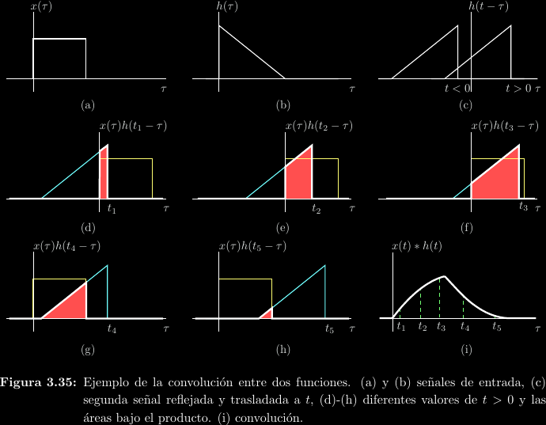

# Sistemas LTI

Recuérdese que un sistema es aquello que transforma una señal de entrada en una
señal de salida. Se dice que un sistema es **lineal** si una combinación lineal
de dos señales de entrada cualesquiera produce una combinación lineal
respectiva en la salida.
\\[\mathcal{T}\\{\alpha_1x_1(t) + \alpha_2x_2(t)\\} = \alpha_1y_1(t) + \alpha_2y_2(t)\\]

Por esto es que decimos que los elementos eléctricos pasivo-reactivos son
lineales, a pesar de que sus relaciones tensión-corriente no son una ecuación
lineal. Para el caso del capacitor,
\\[
\begin{align*}
i(t) &= C\frac{\mathrm{d}v}{\mathrm{d}t} \\\\
&= C\frac{\mathrm{d}}{\mathrm{d}t}(\alpha_1v_1(t) + \alpha_2v_2(t)) \\\\
&= C\alpha_1\frac{\mathrm{d}v_1}{\mathrm{d}t} + C\alpha_2\frac{\mathrm{d}v_2}{\mathrm{d}t} \\\\
&= \alpha_1i_1(t) + \alpha_2i_2(t)
\end{align*}
\\]

Esta también es la razón por la que decimos que un diodo semiconductor no es lineal:
\\[
\begin{align*}
i(t) &= I_s \exp\\left[\frac{V_D(t)}{V_t}\\right] \\\\
&= I_s \exp\\left[\frac{\alpha_1 V_1(t) + \alpha_2 V_2(t)}{V_t}\\right] \\\\
&= I_s \exp\\left[\frac{\alpha_1 V_1(t)}{V_t}\\right]\exp\\left[\frac{\alpha_2 V_2(t)}{V_t}\\right] \\\\
&= I_s\\left(\frac{i_1(t)}{I_s}\\right)^{\alpha_1}\\left(\frac{i_2(t)}{I_s}\\right)^{\alpha_2} \\\\
&\ne \alpha_1i_1(t) + \alpha_2i_2(t)
\end{align*}
\\]

Hay muchos sistemas que parecen lineales pero no lo son. Por ejemplo,
\\[
\begin{align*}
y(t) &= x(t) + c; c \ne 0 \\\\
&= \alpha_1x_1(t) + \alpha_2x_2(t) + c \\\\
&\ne \alpha_1(x_1(t) + c) + \alpha_2(x_2(t) + c) \\\\
&= \alpha_1y_1(t) + \alpha_2y_2(t)
\end{align*}
\\]

Otra propiedad importante es la **invarianza en el tiempo**. Un sistema es
invariante en el tiempo si no depende de una variable temporal absoluta.  Es
decir, si la referencia de reloj de un sistema invariante en el tiempo se corre
por un desplazamiento arbitrario, la salida se corre igualmente:
\\[\mathcal{T}\\{x(t - t_0)\\} = y(t - t_0); \forall t_0\in\mathbb{R}\\]

Si un sistema es simultáneamente lineal e invariante en el tiempo, se abrevia
como **LTI**.

## Convolución

Conforme el ancho de los rectángulos de la imagen anterior tiende a cero, los
mismos tienden a un impulso unitario, ya que siempre tendrán un área de
\\(1\\). La salida debido a un único impulso \\(h(t) =
\mathcal{T}\\{\delta(t)\\}\\) se conoce como **respuesta al impulso**.

La **convolución** es una operación integral que juega un papel importante en
todo esto.
\\[
\begin{align*}
  f(t) * g(t) &= \int_{-\infty}^{\infty}{f(\tau)g(t - \tau)\mathrm{d}\tau} \\\\
  \mathcal{F}\\{f(t) * g(t)\\} &= F(j\omega)G(j\omega)
\end{align*}
\\]

La característica más importante de la convolución es que su transformada es el
producto de las transformadas de las funciones que se convolucionan. La
definición integral no suele utilizarse directamente. Puede demostrarse que la
aproximación en forma de rectángulos que se realizó en una imagen anterior
tiende a una convolución. Por tanto, en un sistema LTI donde \\(y(t) =
\mathcal{T}\\{x(t)\\}\\) se puede afirmar que:

\\[
\begin{align*}
  y(t) &= x(t) * h(t) = h(t) * x(t) \\\\
  Y(j\omega) &= X(j\omega)H(j\omega) \\\\
  y(t) &= \mathcal{F}^{-1}\left\\{\mathcal{F}\\{x(t)\\}\mathcal{F}\\{\mathcal{T}\\{\delta(t)\\}\\}\right\\}
\end{align*}
\\]

Donde \\(H(j\omega)\\) es la **respuesta en frecuencia** del sistema. La
utilidad de esta teoría es enorme. Significa que si un sistema es LTI, entonces
se puede conocer con facilidad su respuesta a cualquier entrada a partir de la
transformada directa de Fourier y la transformada inversa de Fourier.

## Causalidad

Si la señal de entrada comienza a presentarse a partir de al menos \\(t = 0\\),
entonces un sistema puede:

- Tener una respuesta al menos a partir de \\(t = 0\\): Se dice **causal**, ya
  que la entrada provoca la salida en ese orden. Todo sistema físico o temporal
  es causal.

- Tener una respuesta antes de \\(t = 0\\): Se habla de un sistema **no
  causal**, puesto que la entrada no está ordenada con respecto a la salida.
  Esto más fácil de imaginar si se piensa que existen otras variables
  independientes posibles aparte del tiempo. Por analogía con el tiempo, puede
  decirse que es un sistema que es capaz de "ver el futuro".

- Un caso especial de sistemas no causales son los sistemas **acausales**, en
  los cuales no hay salida después de la entrada.

## Estabilidad

Si la magnitud de la entrada está **acotada** por \\(0 < |x(t)| \le A_x\\), el
sistema es **estable** si y solo si esto implica que la salida está igualmente
acotada por \\(0 \le |y(t)| \le A_y\\). Este principio se conoce como **BIBO**
(bounded input, bounded output). En el caso de sistemas LTI, puede demostrarse
que el sistema es estable si y solo si su respuesta al impulso es absolutamente
integrable:
\\[\int_{-\infty}^{\infty}{|h(t)|\mathrm{d}t} < \infty\\]
