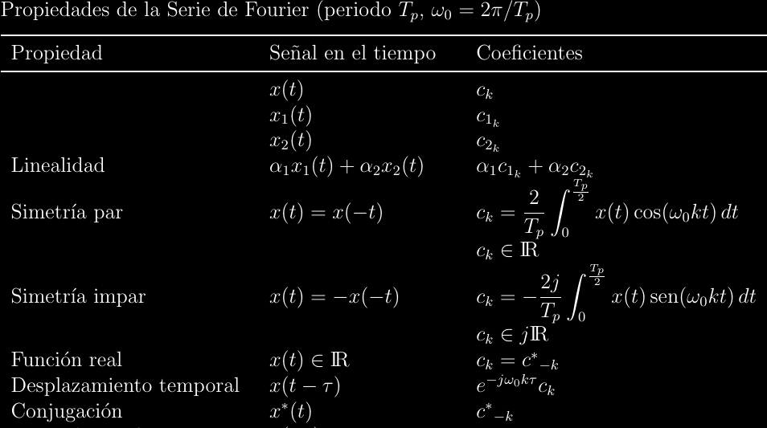

# Series de Fourier

La síntesis de una función \\(f(x)\\) como la combinación lineal de una base
funcional ortonormal \\(\\{u_k(x)\\}; k\in\mathbb Z\\) con un vector funcional
generador \\(c_k\\) se da de manera natural por:
\\[f(x) = \sum_{k = -\infty}^{\infty}{c_k u_k(x)}\\]

A la anterior se le conoce como **serie de Fourier generalizada**, su nombre
viene de que sirve para cualquier base funcional ortogonal. Dada una escogencia
de \\(u_k(x)\\), es necesario descomponer a la función \\(f(x)\\) en cada una
de sus dimensiones desde la perspectiva de la base \\({ u_k(x) }\\).

Considérese un caso simplifcado con tal de encontrar \\(c_k\\). Sea el vector
euclídeo \\((3, 5)\\) junto a la base ortogonal \\({(2, 0), (0, 6)}\\).
Intuitivamente, podemos decir que hay "\\(\frac{3}{2}\\) de 2" en la primera
coordenada de base: \\(3\\). También puede decirse que hay "\\(\frac{5}{6}\\) de
\\(6\\)" en la coordenada de valor \\(6\\) de la base.  Sin pembargo, al calcular el
producto punto del vector deseado con cada vector de la base se obtiene:
\\[\\begin{align*}(3, 5)\cdot(2, 0) &= 3\cdot 2 = 6\\\\(3, 5)\cdot(0, 6) &=
5\cdot 6 = 30\\\\\\end{align*}\\]

Si la operación terminara aquí, esto querría decir que \\(c = (5, 30)\\), pero
eso no puede estar bien, ya que se obtendría un valor distinto al sintetizar.
Nótese que el "problema" es que el producto punto multiplica por cada dimensión
de cada vector de la base, en vez de dividir. Podemos arreglar esto al dividir
por el cuadrado de las magnitudes de los vectores de la base:
\\[\\begin{align*}\frac{3\cdot 2}{2^2} = \frac{3}{2}\\\\\frac{5\cdot 6}{6^2} = \frac{5}{6}\\\\\\end{align*}\\]

Estos valores sí representan apropiadamente la descomposición del vector
original en sus constituyentes respecto a la base, tal que \\(c =
\\left(\frac{3}{2}, \frac{5}{6}\\right)\\). Esta operación de encontrar los
coeficientes \\(c_k\\) se conoce como **análisis**, en algún sentido el opuesto
de síntesis. Así, **análisis de Fourier** es cualquier análisis realizado
dentro de un espacio funcional. El análisis de Fourier para series generales
viene dado por:
\\[c_k = \frac{\langle u_k(x), f(x)\rangle}{\\|u_k(x)\\|^2}\\]

Nótese que esto es solo una generalización algebraica del argumento anterior
para vectores euclídeos. El numerador de esta fracción dice "cuánto" de
\\(u_k(x)\\) hay en \\(f(x)\\), mientras que el denominador normaliza el
elemento de la base (la base debe ser ortogonal, pero puede no ser ortonormal).

## Serie exponencial compleja

La variable independiente se tomará ahora como \\(t\\) en vez de \\(x\\), ya
que típicamente representa tiempo real. Si la función \\(f(t)\\) es periódica
con frecuencia fundamental \\(\omega_0 = \frac{2\pi}{T}\\), entonces se puede
sintetizar a \\(f(t)\\) como:
\\[f(t) = \sum_{k = -\infty}^{\infty}{c_k e^{j\omega_0 kt}}\\]

Y su análisis, para cualquier \\(t_0\\) en el dominio, es:
\\[c_k = \frac{1}{T}\int_{t_0}^{t_0 + T}{e^{-j\omega_0 kt}f(t)\mathrm{d}t}\\]

La familia de funciones \\(\\{ e^{j\omega_0 kt}; k \in \mathbb{Z} \\}\\) es
ortogonal y **armónicamente relacionada**.

## Series trigonométricas

Mucha de la matemática que hemos cubierto no había sido desarrollada cuando
Joseph Fourier describió originalmente su teoría. Su formulación original de la
síntesis de funciones fue en términos de senos y cosenos, a lo que se le
denomina **serie trigonométrica**:
\\[
  \\begin{align*}
    f(t) &= \frac{1}{2}a_0 + \sum_{k = 1}^{\infty}{a_k\cos(\omega_0kt)} + \sum_{k = 1}^{\infty}{b_k\sin(\omega_0kt)} \\\\
	c_k &= \frac{a_k - jb_k}{2} \\\\
	a_k &= 2\mathrm{Re}\\{c_k\\} = 2|c_k|\cos(\theta_k) = \frac{2}{T}\int_{t_0}^{t_0 + T}{f(t)\cos(\omega_0kt)\mathrm{d}t} \\\\
	b_k &= -2\mathrm{Im}\\{c_k\\} = -2|c_k|\sin(\theta_k) = \frac{2}{T}\int_{t_0}^{t_0 + T}{f(t)\sin(\omega_0kt)\mathrm{d}t}
  \\end{align*}
\\]

Esta expresión nos acerca más al significado fundamental de las series de
Fourier, ya que observamos que la función original **es** una suma de senos y
cosenos que coinciden de la manera correcta para constituir a la función. Es
posible reducir los senos a cosenos desfasados, con lo cual se obtiene una sola
suma en forma de la **serie de cosenoidales desfasadas**:
\\[
  \\begin{align*}
    f(t) &= c_0 + \sum_{k = 1}^{\infty}{\widetilde{c}_k\cos(\omega_0kt + \theta_k)} \\\\
	\widetilde{c}_k &= 2|c_k| \\\\
	\theta_k &= \angle c_k
  \\end{align*}
\\]

Con esto llegamos al hecho más importante acerca de las series de Fourier: cada
armónico, con su respectiva frecuencia que es múltiplo de la frecuencia
fundamental, está asociado a una amplitud y un desfase, la síntesis no es más
que la combinación lineal de las sinusoides respectivas. Posteriormente,
extenderemos esta idea a señales no periódicas con la transformada de Fourier.

Al "rebote" alrededor de discontinuidades, como se observa en la imagen
anterior, se le conoce como **fenómeno de Gibbs** y es uno de los
requerimientos del análisis de Fourier: solo funciona bien en vecindades
continuas. Luego se cubrirán herramientas que permiten estudiar sistemas no
continuos.

Los coeficientes \\(c_k\\) tienen un significado importante que se estudiará
más adelante. A su graficación se denomina **espectro** de \\(f(t)\\).

## Propiedades del análisis

- El análisis es **lineal**.

- Los coeficientes del análisis de una función par tienen parte imaginaria
  nula. \\(f(t) = \cos(t)\\) es un ejemplo de una función par.

- Los coeficientes del análisis de una función impar tienen parte real
  nula. \\(f(t) = \sin(t)\\) es un ejemplo de una función impar.

- Por corolario de lo anterior, toda función puede separarse en componentes
  simétricas, una par y otra impar, tal como realizamos antes con \\(e^z\\)
  para obtener las funciones trigonométricas hiperbólicas.
  \\[
  \\begin{align*}
    f(t) &= f_e(t) + f_o(t) \\\\
    f_e(t) &= \frac{f(t) + f(-t)}{2} = f_e(-t) \\\\
    f_o(t) &= \frac{f(t) - f(-t)}{2} = -f_o(-t)
  \\end{align*}
  \\]
  Puede verificarse que \\(\cos_o(t) = 0\\) y \\(\sin_e(t) = 0\\).

- Si \\(f(t)\\) es real, entonces \\(c_k\\) es una función **hermítica**: \\(c^*_{-k} = -c_k\\).

- Un desplazamiento temporal de \\(\tau\\) provoca un factor de \\(e^{-j\omega_0 k\tau}\\).

- La diferenciación provoca un factor de \\(jk\omega_0\\).

