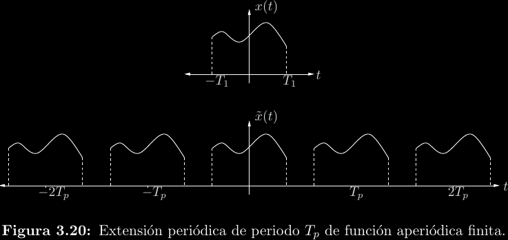
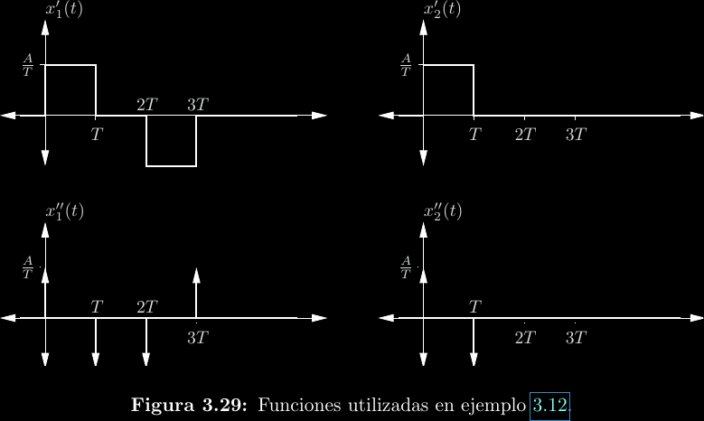
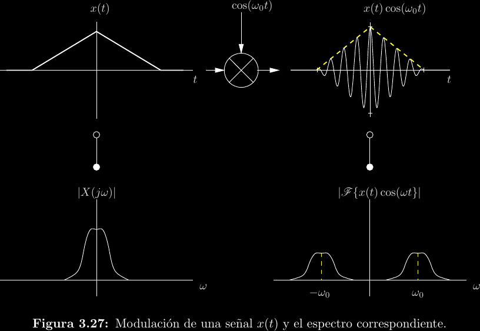
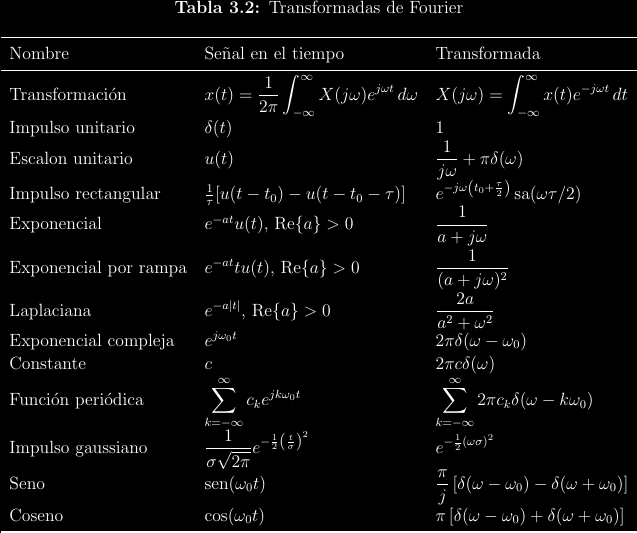
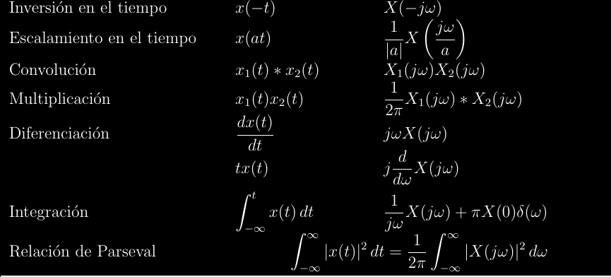

# Transformada de Fourier

Mencionamos que el espectro de una función periódica continua está dado por los
coeficientes \\(c_k\\) que resultan del análisis en series de Fourier.  Además,
notamos que este espectro es una **función discreta**, ya que \\(k\\) es una
variable entera. Luego de desarrollar el análisis y síntesis en series, el
mismo Fourier notó una forma de mejorar una gran limitante de su teoría,
específicamente que solo sirve para funciones periódicas. La idea consistió en
abusar una interpretación de funciones no periódicas, dentro de un rango
finito, como funciones periódicas que tienen a ese rango como período.

Es posible realizar un desarrollo en series de Fourier para el caso anterior.
Claro, solo será válido dentro de la región que realmente corresponde a la
función original. Esta idea funciona, pero tiene otra limitante: el período
"artificial" enmarca qué tanto de la función puede estudiarse de esta forma.
Así, un paso más consiste en establecer \\(T \to \infty\\), con lo que se
obtiene una herramienta capaz de estudiar funciones no periódicas en su
totalidad, a la cual se le denomina **transformada de Fourier**:
\\[F(j\omega) = \mathcal{F}\\{f(t)\\}(j\omega) = \int_{-\infty}^{\infty}{f(t)e^{-j\omega t}\mathrm{d}t}\\]

Nótese que esto no es más que una expresión distinta para los coeficientes de
la serie exponencial compleja, ya que:
\\[c_k = \frac{1}{T}X(jk\omega_0)\\]

La transformada de Fourier es un tipo de **transformada integral**, relaciona a
una función \\(f(t)\\) con otra función \\(F(j\omega)\\). En otras palabras,
transforma del **dominio de tiempo** al **dominio de frecuencia**. Tal como las
series de Fourier sintetizan funciones periódicas a partir de su análisis en
forma de sinusoides desfasadas con frecuencias discretas, una transformada de
Fourier determina el **contenido de frecuencias** de una función. Nótese que
ahora estas frecuencias son continuas y no un múltiplo entero de alguna
frecuencia fundamental.

La transformada de Fourier tiene una **inversa**, que permite pasar del dominio
de frecuencia al dominio de tiempo:
\\[f(t) = \mathcal{F}^{-1}\\{F(j\omega)\\} = \frac{1}{2\pi}\int_{-\infty}^{\infty}{X(j\omega)e^{j\omega t}\mathrm{d}\omega}\\]

La transformada no inversa también se le conoce como **transformada directa**.

## Condiciones de Dirichlet

No toda función tiene una transformada de Fourier definida. Excepto en puntos
de discontinuidad, las **condiciones de Dirichlet** establecen las condiciones
bajos las que esto es posible:

- \\(f(t)\\) debe ser absolutamente integrable.
  \\[\int_{-\infty}^{\infty}{|f(t)|\mathrm{d}t} < \infty\\]

- La cantidad de extremos (máximos y mínimos) locales de \\(f(t)\\) debe ser
  finita dentro de cualquier intervalo finito.

- El número de discontinuidades de \\(f(t)\\) debe ser finito dentro de
  cualquier intervalo finito.

## Escalón unitario e impulso unitario

El escalón unitario es una discontinuidad de "encendido o apagado", definido por:
\\[
    u(t) = \\begin{cases}
	  0; & t < 0 \\\\
	  1; & t \ge 0
	\\end{cases}
\\]

Por su parte, el impulso unitario representa un cambio brusco en un instante
de tiempo:
\\[\delta(t) = \\begin{cases} 0; & t \ne 0 \\\\ \infty; & t = 0 \\end{cases}\\]

Y están relacionadas por
\\[\frac{\mathrm{d}}{\mathrm{d}t}u(t) = \delta(t)\\]

## Algunas transformadas de Fourier

## Propiedades

