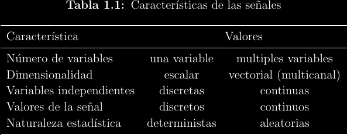
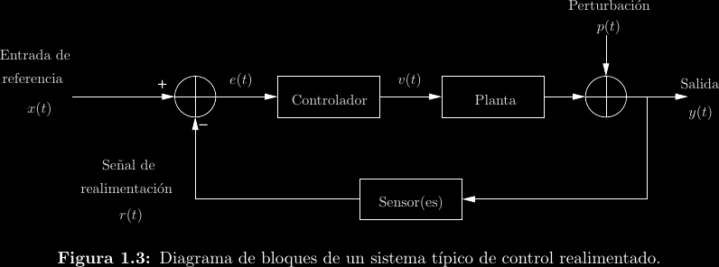

# Créditos

Autor: Alejandro Soto

La gran mayoría de este resumen está basado en material elaborado por Pablo
Alvarado para uso en EL4703 Señales y Sistemas.

# Introducción

Muchas herremientas matemáticas son indispensables en el estudio, diseño e
implementación de sistemas en ingeniería. Este curso introduce algunas de
ellas.

## Señales

Una **señal** es una función que contiene información.

- Número de variables: ¿De cuántos estados mutuamente independientes depende la señal?

- Dimensionalidad: ¿Cuántas escalas distintas expresa el valor de la señal?

- Discreto o continuo: ¿La cantidad de valores válidos entre cualesquiera otros
  dos valores válidos distintos es siempre infinita?

- Determinismo: ¿Puedo predicir la señal dada su historia?

## Sistemas

Un **sistema** es aquello que transforma una señal en otra. Se dice entonces
que un sistema tiene una señal de entrada y una señal de salida. Se representan
típicamente por medio de diagramas de bloques:

## Modelos

Los **modelos** son descripciones formales de sistemas. Por ejemplo, en este
curso estudiamos modelos matemáticos para sistemas que involucran señales de
variable y valor continuo o discreto.
