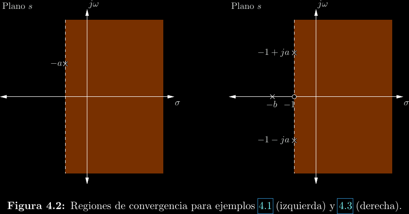
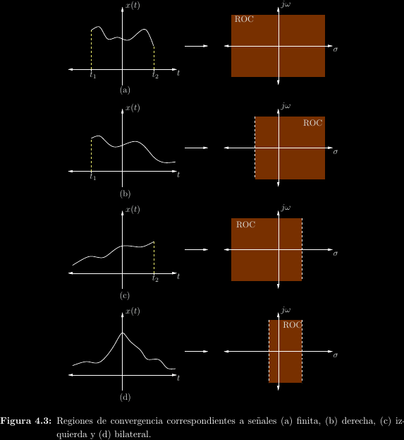
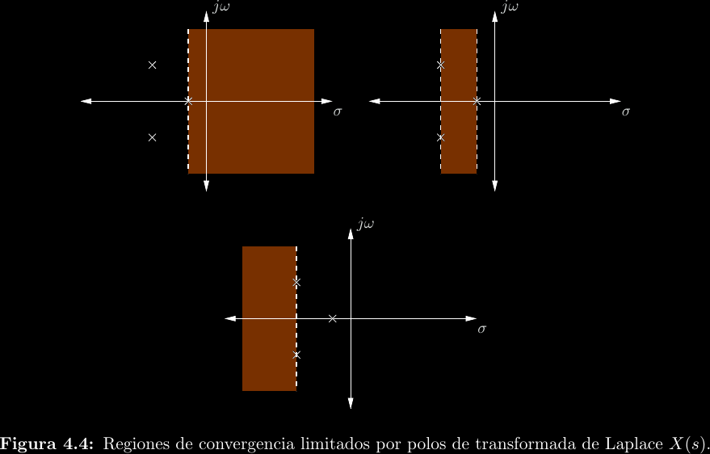
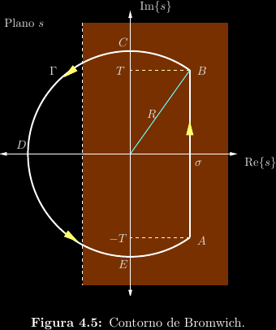
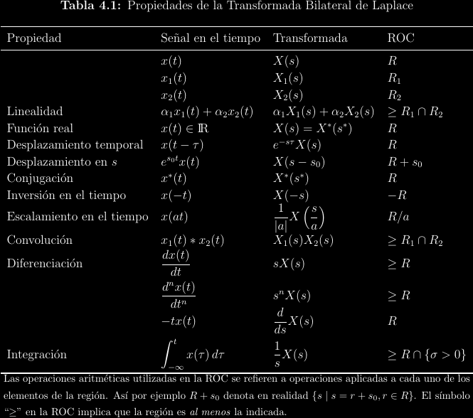
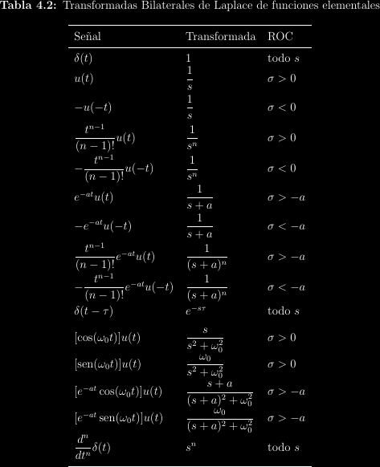

# Transformada bilateral de Laplace

## Limitaciones de la transformada de Fourier

Sea la señal \\(f(t) = e^t u(t)\\). Según la definición de la
transformada de Fourier:

\\[
\begin{align*}
  F(j\omega) &= \int_{-\infty}^{\infty}{e^t u(t)e^{-j\omega t}\mathrm{d}t} \\\\
  &= \int_0^{\infty}{e^{(1 - j\omega)t}\mathrm{d}t} \\\\
  &= \lim_{t \to \infty}{\frac{1}{1 - j\omega}\left[e^{(1 - j\omega)t} - e^{(1 - j\omega)\cdot 0}\right]} \\\\
  &= \lim_{t \to \infty}{\frac{1}{1 - j\omega}\left[e^t e^{-j\omega t} - 1\right]}
\end{align*}
\\]

Tanto la magnitud \\(e^t\\) como la fase \\(-j\omega t\\) divergen, así que el
límite diverge. En otras palabras, no existe la transformada de Fourier de
\\(e^t u(t)\\).

## Corrección de la convergencia

Recuérdese que la variable frecuencial de la transformada de Fourier es
\\(j\omega\\) y no \\(\omega\\). Hasta el momento ello pudo parecer una simple
escogencia estilística, pero en realidad no lo es. Si una función no cumple las
condiciones de Dirichlet, es en ocasiones posible encontrar una transformada de
Fourier si se multiplican las señales por una exponencial conveniente. Tomando
el mismo caso anterior, sea \\(g(t) = f(t)e^{-5t}\\). Repitiendo el proceso,

\\[
G(j\omega) = \mathcal{F}\\{f(t)e^{-5t}\\} = \mathcal{F}\\{e^{-4t} u(t)\\} = \frac{1}{j\omega + 4}
\\]

En un caso más general, puede definirse una constante \\(\sigma > 1; \sigma \in
\mathbb{R}\\) tal que \\(g(t) = f(t)e^{-\sigma t}\\). Se tiene ahora que:

\\[
G(j\omega) = \mathcal{F}\\{f(t)e^{-\sigma t}\\} = \mathcal{F}\\{e^{-(\sigma - 1)t} u(t)\\} = \frac{1}{j\omega + \sigma - 1}
\\]

No es coincidencia que \\(\sigma\\) y \\(j\omega\\) se sumen en el resultado,
puesto que la transformada está definida como:

\\[G(j\omega) = \int_{-\infty}^{\infty}{e^t u(t) e^{-\sigma t}e^{-j\omega t}\mathrm{d}t}
= \int_{-\infty}^{\infty}{e^t u(t) e^{-(\sigma + j\omega)t}\mathrm{d}t}\\]

Por lo cual es esperable que, tal como la respuesta antes dependía de la variable
\\(j\omega\\), ahora lo haga de una nueva variable \\(s = \sigma + j\omega\\). Por
tanto,

\\[F(s) = F(\sigma + j\omega) = \frac{1}{s - 1}\\]

A \\(s\\) se le llama **frecuencia compleja**. Esta transformada
generalizada, expresada en términos de frecuencia compleja, se llama
**transformada de Laplace**.

\\[F(s) = F(\sigma + j\omega) = \mathcal{L}\\{f(t)\\} = \int_{-\infty}^{\infty}{f(t)e^{-st}\mathrm{d}t}\\]

Esta definición no es válida para cualquier \\(s\\), ya que solo algunos
valores de \\(\sigma\\) lograrán satisfacer las condiciones de Dirichlet. Por
ejemplo, se mencionó que para la función \\(g(t)\\) antes definida, debe
satisfacerse \\(\sigma = \mathrm{Re}\\{s\\} > 1\\). Para el ejemplo inicial
decimos que:
\\[\mathcal{L}\\{e^t u(t)\\} = \frac{1}{s - 1}; \sigma > 1\\]

Como se demostró al inicio, la transformada de Fourier no es capaz de analizar
esta función, pero ahora se encuentra que la de Laplace sí puede hacerlo.
Nótese que si \\(\sigma = 0\\) entonces la transformada de Laplace se reduce a
la transformada de Fourier.

## Identidad de las transformadas integrales

A la anterior también se le suele conocer como **transformada bilateral de
Laplace** debido a que un caso especial de ella, llamada transformada
unilateral de Laplace, es ubicua. Es importante dejar claro que solo existe una
transformada de Laplace, la cual es bilateral. La así llamada "transformada
unilateral" no existe como una transformada distinta, es solo una evaluación
particular de la transformada bilateral. Bajo este mismo argumento, puede
decirse que la transforma de Fourier tampoco es una transformada independiente,
sino un caso especial de la transformada de Laplace. También puede realizarse
la construcción inversa, puesto que ambas transformadas pueden escribirse en
términos de la otra:

\\[
\begin{align*}
  \mathcal{L}\\{f(t)\\}(\sigma + j\omega) &= \mathcal{F}\\{f(t)e^{-\sigma t}\\}(j\omega) \\\\
  \mathcal{F}\\{f(t)\\}(j\omega) &= \mathcal{L}\\{f(t)\\}(0 + j\omega)
\end{align*}
\\]

Por lo cual son en realidad la misma operación, al punto de ser prácticamente
intercambiables.

## Regiones de convergencia

Como la transformada de Laplace es válida solo para algunos \\(\sigma\\), las
ROC el **plano \\(s\\)** serán siempre planos paralelos al eje imaginario. El
plano siempre bordeará los polos de la transformada

## Naturaleza de extensión

Una función se denomina:

- **Finita** si no se extiende hasta ninguna infinidad.

- **Izquierda** si se extiende hasta \\(-\infty\\) pero no hasta \\(+\infty\\).

- **Derecha** si se extiende hasta \\(+\infty\\) pero no hasta \\(-\infty\\).
  Nótese que toda función causal debe ser derecha.

- **Bilateral** si se extiende hasta \\(\pm\infty\\).

Que una función "no se extienda" quiere decir que se anula (adquiere un valor
de cero).  Nótese que una función no tiene que extenderse solo en \\(t \le 0\\)
para ser izquierda, simplemente debe estarlo en \\(t < \kappa\\) para cualquier
\\(\kappa\\) finito. La naturaleza de extensión de la función afecta la
orientación de la ROC.

## Fourier y el plano \\(s\\)

La transformada de Fourier existe solo cuando la recta imaginaria \\(j\omega\\)
es parte de la ROC. Por esta razón, puede pensarse en la transformada de
Fourier como una operación a lo largo del eje imaginario del plano \\(s\\).

## Transformada inversa de Laplace

La transformada de Laplace también tiene **inversa**:
\\[
\begin{align*}
f(t) &= \frac{1}{2\pi}\int_{-\infty}^{\infty}{F(\sigma + j\omega)e^{(\sigma + j\omega)t}\mathrm{d}\omega} \\\\
&= \frac{1}{2\pi j}\int_{\sigma - j\infty}^{\sigma + j\infty}{F(s)e^{st}\mathrm{d}s} \\\\
&= \frac{1}{2\pi j}\oint_C{F(s)e^{st}\mathrm{d}s}
\end{align*}
\\]

## Propiedades

## Algunas transformadas

