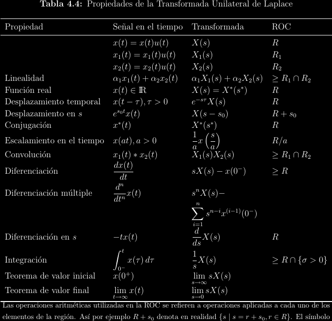
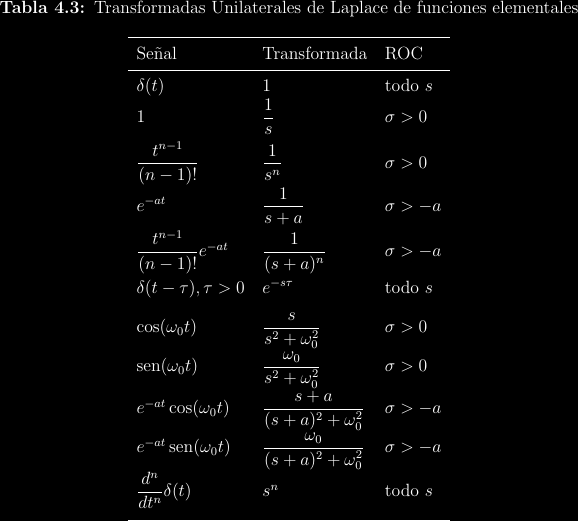

# Transformada unilateral de Laplace

## Laplace y sistemas LTI

Dado un sistema LTI, se puede hacer exactamente el mismo análisis convolucional
que se realizó para la transformada de Fourier, obteniendo:

\\[
\begin{align*}
y(t) &= h(t) * x(t) \\\\
\implies Y(s) &= H(s)X(s)
\end{align*}
\\]

Esta aplicación es más poderosa que con Fourier, ya que sirve para sistemas
inestables que la transformada de Fourier no puede estudiar.

## Estabilidad y causalidad

Si un plano \\(s\\) contiene a \\(j\omega\\), entonces la función tiene
transformada de Fourier y por tanto es BIBO-estable.

La causalidad puede relacionarse con la extensión de la ROC en el plano
\\(s\\), puesto que un sistema derecho con corte en \\(t > 0\\) es causal.

## Transformada unilateral

Frecuentemente interesa el análisis de sistemas causales. Para una función
causal \\(f(t)\\) se anula un lado de la integral de Laplace, ya que \\(t < 0 \implies
f(t) = 0\\):

\\[F(s) = \int_{-\infty}^{\infty}{f(t)e^{-st}\mathrm{d}t} = \int_0^{\infty}{f(t)e^{-st}\mathrm{d}t}\\]

Algunas funciones están definidas con valores no nulos para \\(t < 0\\), pero
solo interesan en la región causal. Esto se logra multiplicando a la función
por un escalón unitario. Por ejemplo, \\(e^-t \ne 0, t < 0\\), pero un sistema
real podría estar modelado por \\(f(t) = e^-t u(t)\\), que sí es una función
causal.  En el caso general se define a la **transformada unilateral de Laplace**:

\\[F_u(s) = \mathcal{L_u}\\{f(t)\\} = \mathcal{L}\\{f(t)u(t)\\} = \int_0^{\infty}{f(t)e^{-st}\mathrm{d}t}\\]

Por tanto, un sistema causal siempre debe analizarse con la transformada unilateral.

## Propiedades

## Algunas transformadas unilaterales

