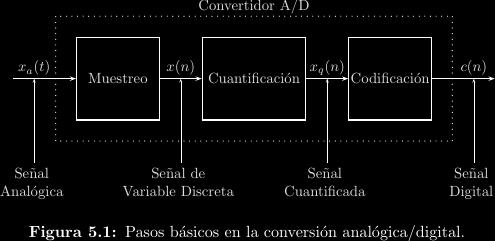
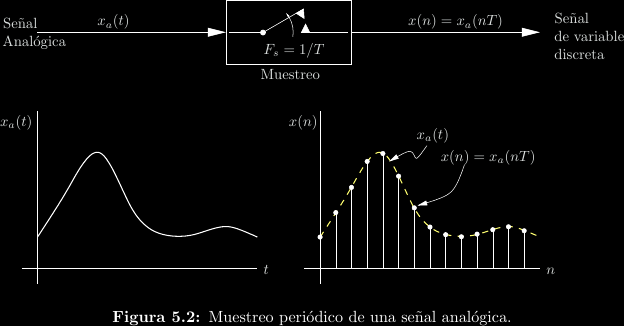
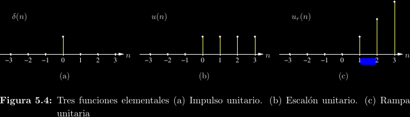
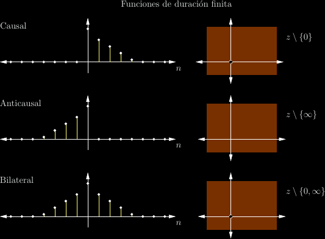
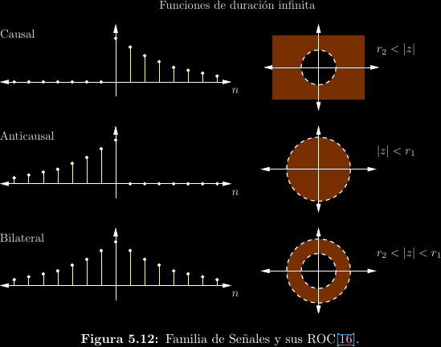
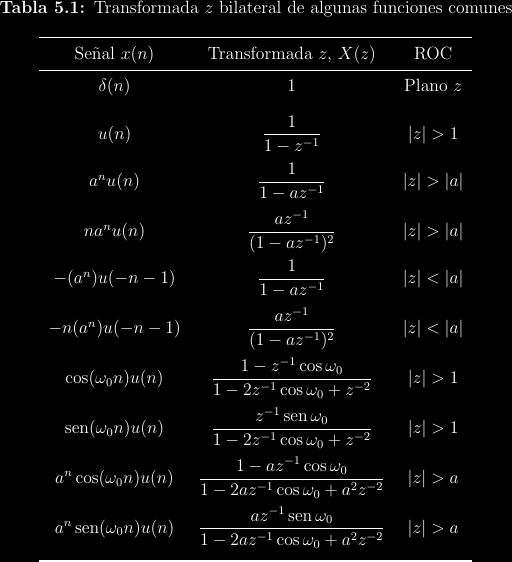
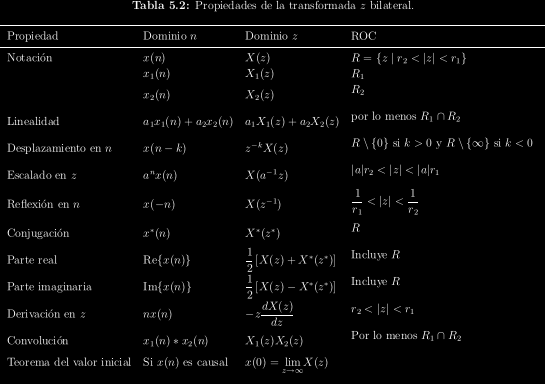

# Funciones en tiempo discreto

Recordar de la introducción del curso que una señal puede ser **continua** o
**discreta**, lo cual se refiere a si la señal está definida para precisiones
arbitrariamente bajas de la variable independiente o si solo existe para
algunos valores particulares de la variable independiente, típicamente
**incrementos enteros**.

Los caso más evidente de señales discretas aparecen en **sistemas digitales**,
en los cuales los valores de la señal son discretos y finitos. Las señales
continuas, por otro lado, suelen estar asociadas a **sistemas analógicos**.
Los sistemas físicos son primordialmente analógicos, por lo cual una gran parte
de la electrónica se dedica a este caso. Cuando un sistema físico ha de
interactuar con un sistema digital, se vuelve necesario un **ADC** que
convierte de señales analógicas a digitales.

Un ADC:

- **Muestrea** una señal a un intervalo regular, recolectando valores continuos
en tiempo discreto.

- **Cuantifica** y **codifica** los valores continuos para obtener una señal
  digital. Por ejemplo, un ADC de 12 bits puede emitir un resultado de entre 0,
  1, 2, ..., 4094 ó 4095 (\\(2^{12} - 1\\)). Existe un **error** asociado a
  este proceso: si 0 corresponde a -3.3V y 4095 corresponde a 3.3V, no es
  posible codificar perfectamente un cambio de 1V, ya que la división es
  \\(\frac{6.6}{4095} \approx 0.0016\\).

Las funciones en tiempo discreto que se tratan en este curso **no están
definidas para entradas no enteras**, ni siquiera son de valor cero.

## Discretización de funciones utilitarias

Antes se tenía que:
\\[u(t) = \int_{-\infty}^t{\delta(\tau)\mathrm{d}\tau}\\]
Por lo que ahora decimos:
\\[u(n) = \sum_{m = -\infty}^n \delta(m)\\]

Así que:
\\[
\begin{align*}
u(n) &= \begin{cases}
0; & n < 0 \\\\
1; & n \ge 0
\end{cases} \\\\
\delta(n) &= \begin{cases}
0; & n \ne 0 \\\\
1; & n = 0
\end{cases}
\end{align*}
\\]

## Muestreos

Matemáticamente, el muestreo uniforme de una función \\(f(t)\\) a una **tasa de
muestreo** de \\(\frac{1}{T}\\) puede visualizarse como:
\\[\hat f(t) = \sum_{n = -\infty}^{\infty}{f(nT)\delta(t - nT)}\\]

Un teorema muy importante en teoría de información es el **teorema del
muestre**, el cual dice que la tasa de muestreo \\(\frac{1}{T}\\) debe ser al
menos el doble que el ancho de bancha del espectro de la función para que no
ocurra pérdida de información al muestrear.

## Transformada \\(z\\)

Tómese la transformada de Laplace de una señal muestread
\\[
\begin{align*}
\mathcal{L}\\{\hat f(t)\\} &= \int_{-\infty}^{\infty}{\left[\sum_{n = -\infty}^{\infty}{f(nT)\delta(t - nT)}\right]e^{-st}\mathrm{d}t} \\\\
&= \sum_{n = -\infty}^{\infty}{f(nT)\int_{-\infty}^{\infty}{\delta(t - nT)e^{-st}\mathrm{d}t}} \\\\
&= \sum_{n = -\infty}^{\infty}{f(nT)e^{-snT}}
\end{align*}
\\]

Sean \\(g(n) = f(nT)\\) y \\(z = e^{sT}; z \in \mathbb{C}\\), por lo cual,
\\[
\mathcal{L}\\{\hat f(t)\\} = \sum_{-\infty}^{\infty}{g(n)z^{-n}}
\\]

A esta operación se le llama **transformada \\(z\\) bilateral**. En otras
palabras,
\\[\mathcal{Z}\\{f(nT)\\} = \mathcal{L}\\{\hat f(t)\\}\\]

Explícitamente,
\\[X(z) = \mathcal{Z}\\{x(n)\\} = \sum_{n = -\infty}^{\infty}{x(n)z^{-n}}\\]

Nótese que la transformada \\(z\\):

- Es una **transformada discreta**, no una transformada integral.

- Es una serie de Laurent.

- Como es una serie de potencias, converge solo dentro de una ROC.

- Está centrada en el origen.

- Su entrada es una función de variable entera.

- Su salida es una función de variable compleja.

- \\(z = e^{sT}\\) es un mapeo del plano \\(s = \sigma + j\omega\\) al plano
  \\(z\\).

## Transformada inversa

Semejante al caso general con Laplace, la transformada \\(z\\) inversa es:
\\[x(n) = \frac{1}{2\pi j}\oint_C{X(z)z^{n - 1}\mathrm{d}z}\\]

Donde \\(C\\) es cualquier contorno positivo dentro de la ROC que rodee al
origen.

## Algunas transformadas

## Propiedades

