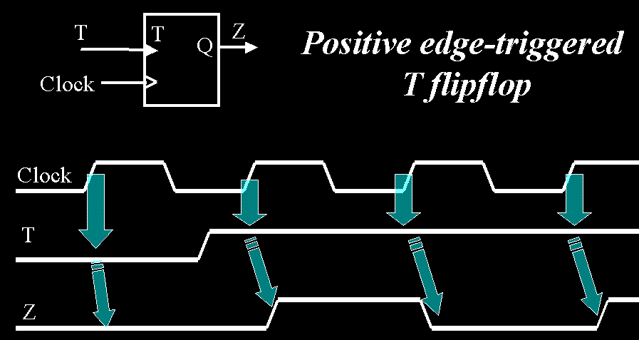
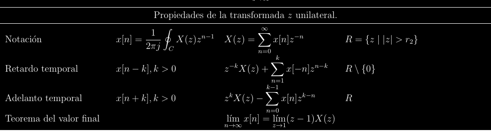
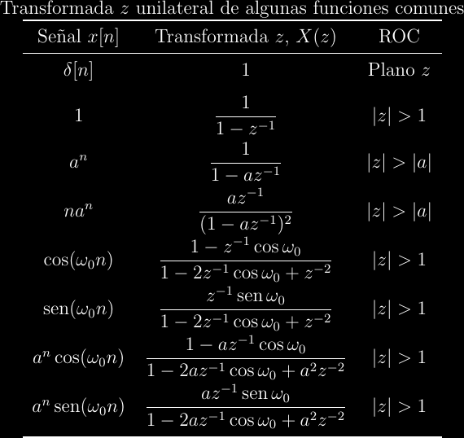
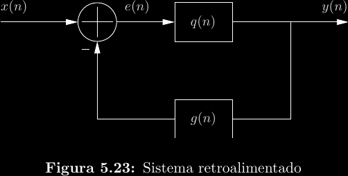

# Sistemas en tiempo discreto

## Sistemas LTI

La misma teoría para sistemas LTI aplica aquí.

## Convolución discreta

La integral se vuelve una suma.

\\[y(n) = x(n)*h(n) = \sum_{k = -\infty}^{\infty}{x(k)h(n - k)}\\]

## Ecuaciones de diferencias

Una **ecuación de diferencias** es el ańalogo discreto de una ecuación
diferencial. Generalmente, estas ecuaciones surgen de **recursión**: la
dependencia de un estado \\(y(n)\\) en un estado previo \\(y(n - k)\\) en el
caso causal, o un estado futuro \\(y(n + k)\\) en el caso acausal. Esto
típicamente aparece en sistemas retroalimentados. Por ejemplo, un flip-flop T
puede modelarse a partir de la siguiente ecuación de diferencias:
\\[Q(n) = Q(n - 1)\oplus T(n)\\]

El sistema discreto conformado por este flip-flop necesita de exactamente una
**condición inicial**, ya que la ecuación de diferencias no establece el estado
al momento del primer flanco de reloj, solo la relación entre estados sucesivos.
La condición inicial en la figura anterior es \\(y(-1) = 0\\).

Al igual que con la transformada de Laplace y ecuaciones diferenciales, la
resolución de ecuaciones de diferencias requiere la **transformada \\(z\\)
unilateral**.

\\[F_u(n) = \mathcal Z_u\\{f(n)\\} = \sum_0^{\infty}{f(n)z^{-n}}\\]

## Propiedades de la transformada unilateral

## Algunas transformadas unilaterales

## Descomposición de la respuesta

Toda respuesta de cualquier sistema puede expresarse como la suma de dos
componentes:

- La **respuesta natural** \\(y_{zi}(n)\\), la cual ocurre cuando la
  entrada es nula ("zero input").

- La **respuesta forzada** \\(y_{zs}(n)\\), la cual ocurre cuando las
  condiciones iniciales son nulas ("zero state").

\\[y(n) = y_{zi}(n) + y_{zs}(n)\\]

La respuesta natural siempre estará asociada a las condiciones iniciales, y la
respuesta forzada siempre estará asociada a la entrada. Por ejemplo, la
respuesta completa en dominio \\(z\\) de un sistema puede ser:

\\[Y(z) = {\frac{\frac{4}{5}y(-1) - \frac{1}{4}z^{-1}y(-2)}{1 - \frac{4}{5}z^{-1} + \frac{1}{4}z^{-2}}} + {\frac{1 - z^{-2}}{1 + \frac{1}{4}z^{-2}}X(z)} = Y_{zi}(n) + Y_{zs}(n) \\]

## Diagramas de bloques

Un **diagrama de bloques** modela a un sistema gráficamente. En el caso de
sistemas discretos, puede encontrarse una ecuación de diferencias a partir de
su diagarama de bloques y viceversa.

En este caso, podemos decir que:

\\[
\begin{align*}
Q(z) &= \frac{Y(z)}{E(z)} \\\\
E(z)Q(z) &= Y(z) \\\\
(X(z) - G(z)Y(z))Q(z) &= Y(z) \\\\
X(z)Q(z) &= Y(z)(1 + G(z)Q(z)) \\\\
\implies H(z) &= \frac{Y(z)}{X(z)} = \frac{Q(z)}{1 + G(z)Q(z)}
\end{align*}
\\]
